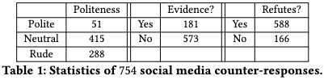

# Reinforcement Learning-based Counter-Misinformation Response Generation: A Case Study of COVID-19 Vaccine Misinformation
This repository contains code and data for our ACM WWW 2023 publication on counter-misinformation response generation. 

If our code or data helps you in your research, please cite:

```
@inproceedings{he2023reinforcement,
  title={Reinforcement Learning-based Counter-Misinformation Response Generation: A Case Study of COVID-19 Vaccine Misinformation},
  author={He, Bing and Ahamad, Mustaque and Kumar, Srijan},
  booktitle={Proceedings of the ACM Web Conference 2023},
  year={2023}
}
```

## Introduction

The COVID-19 vaccine misinformation on social media reduces vaccine uptake and threatens public health. While fact-checkers debunk these false claims, they do not interact with misinformation spreaders. Ordinary users, who make up 96% of counter-misinformation responses, often lack evidence and are rude in their responses. This study aims to create a counter-misinformation response generation model to empower users to effectively correct misinformation. We first create two novel datasets of misinformation and counter-misinformation responses from social media and crowdsourcing. A reinforcement-learning-based text generation model is then proposed to reward the generator to increase the politeness, refutation attitude, and factuality while retaining text fluency and relevancy. Through extensive experiments, the model outperforms baselines in generating high-quality responses, demonstrating the potential for generative text models for social good.


## Quickstart

### 1. Setup and Installation

Our framework can be compiled on Python 3 environments. The modules used in our code can be installed using:
```
$ pip install -r requirements.txt
```

or 

```
$ conda env create -f environment.yml
```


### 2. Prepare dataset

A sample raw input data file is available in [dataset/sample_data.tsv](dataset/sample_data.tsv). Each line in the file has a tweet and a corresponding counter-response (tab-separated). This input file can be converted into a format that is recognized by the model using with following command:
```
python src/process_data.py --corpus dataset/sample_data.tsv --if_input_src_only
```

Running this command will generate a folder named `sample_data.128len.db`.

### 3. Training the model
For training our model on the sample input data, run the following command:

```
python src/train_model.py \
	--model_name_or_path models/medium/ \
	--train_input_file dataset/sample_data.128len.if_input_src_only.db \
	--output_dir output/ \
	--log_dir output/ \
	--train_batch_size 4 \
	--num_optim_steps 100
```
Before running this code, 
1. You will need a DialoGPT-like transformer model for initialization (`model_name_or_path`, ideally finetuned on your dataset, check the warm-up start in the paper);
2. You will need to separately train multiple reward functions for the reinforcement learning framework. Here, we have three reward functions: politeness, refutation, and evidence reward classifiers. The locations of classifiers are specified in politeness_clf_fp, refutation_clf_fp, evidence_clf_fp in variables_ext.py.
3. To configure the reward parameters, please refer to variables_ext.py
4. For sanity check when releasing the codebase, we only use one GPU in the current version. Please revise n_gpu in variables_ext.py when there are multiple GPUs. For the paper, we run our experiments on NVIDIA DGX-1 consisting of 8 V100 GPUs.
5. The repository is based on [DialoGPT](https://github.com/microsoft/DialoGPT) and [Partner](https://github.com/behavioral-data/PARTNER) and uses a similar code structure and environment.

## Dataset

1. In-the-wild social media data containing 754 annotated (misinformation tweet, counter-misinformation reply) pairs. Below is the data statistics:

<center>

</center>

2. Crowdsourcing data containing 591 (misinformation tweet, human-written counter-misinformation reply) pairs. Note that for these 591 human-written replies, they are refuting misinformation, polite, and providing evidence per the requirement in the paper.
3. Our dataset can be found [here](https://www.dropbox.com/sh/5u2mdo53tgh3vrh/AADfYHqhQbt0A2gUciT583E0a?dl=0).
4. We notice the change of Twitter API. If you do not have access to the Twitter data, we can share it with you properly. Please contact Bing He (bhe46@gatech.edu)

If you have any questions, please contact the author Bing He (bhe46@gatech.edu)
